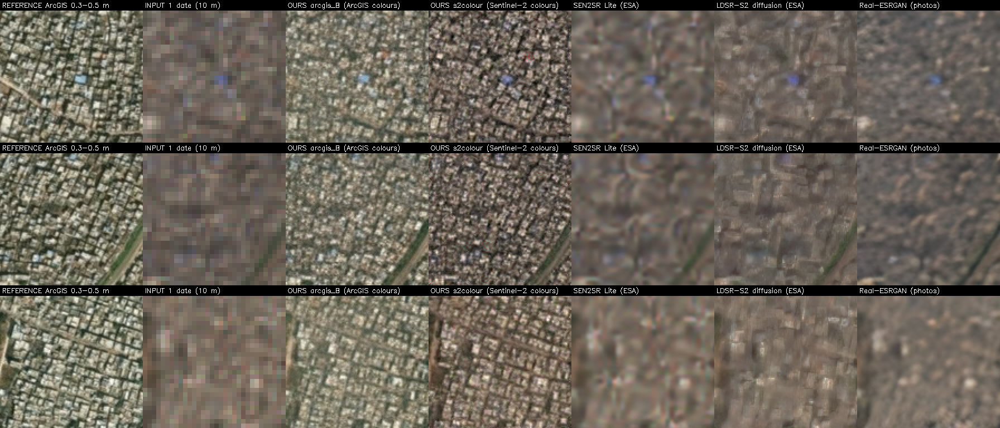

# Multi-date generative super-resolution of Sentinel-2 for India (SIH26142)

**Problem statement SIH26142 (NTRO): *Deep Learning Based Super Resolution Mapping (SRM) from Medium Resolution Satellite Imageries*.** Transform 10 m Sentinel-2 imagery into sharper, information-rich products (< 4 m)
while preserving geospatial and spectral consistency, with pre-processing, training on paired data, accuracy
assessment against high-resolution references, support for crop, urban and disaster applications, and a clear
account of uncertainty and error.

**Our answer:** a super-resolution mapping framework built on a generative adversarial network that reads **8 Sentinel-2 L2A dates** of the same place (10 m) and
produces **2.39 m** imagery. It is the Allen AI Satlas multi-date ESRGAN, fine-tuned on **103,936 real Indian image
pairs** from 55 places against 0.31–0.5 m ArcGIS World Imagery, and tested on **7 whole places it never saw**.
It comes in two versions:

| model | colours | for |
|---|---|---|
| **arcgis_B** | ArcGIS World Imagery look | visual interpretation, digitising, maps |
| **s2colour** | **Sentinel-2's measured colour, locked per 10 m cell** | change detection, comparison with other Sentinel-2 data, anything quantitative |



*Hyderabad old city, a test place. Columns: 0.3–0.5 m reference | one 10 m Sentinel-2 date | **arcgis_B** |
**s2colour** | ESA SEN2SR | ESA LDSR-S2 (diffusion) | Real-ESRGAN.*

## Headline results (7 unseen Indian places, 2,800 tiles)

| model | edge-F1 ↑ | LPIPS ↓ | correct new detail (opensr-test) ↑ | invented detail ↓ | shift vs input (px) ↓ |
|---|---|---|---|---|---|
| **OURS arcgis_B** | **0.642** | **0.182** | **0.510** | 0.264 | 0.08 ¹ |
| **OURS s2colour** | 0.638 | 0.193 | 0.472 | 0.239 | **0.010** ¹ |
| Satlas (the model we started from) | 0.524 | 0.382 | 0.423 | 0.372 | |
| ESA LDSR-S2 (latent diffusion) | 0.492 | 0.349 | 0.447 | 0.166 | |
| Real-ESRGAN | 0.458 | 0.440 | 0.444 | 0.168 | |
| ESA SEN2SR Lite | 0.457 | 0.484 | 0.429 | 0.156 | |
| bicubic | 0.408 | 0.576 | 0.417 | 0.157 | 0.000 |

¹ Measured with fine detail removed; opensr-test's own "spatial" score mistakes added detail for shift
([docs/06](docs/06_geospatial_consistency.md#64-why-opensr-tests-spatial-score-reports-drift-that-is-not-there)).
Full table with PSNR, SSIM, cPSNR and all opensr-test scores: [docs/05](docs/05_evaluation.md).

- **Both models lead every published model on structure and perceptual quality**, at all 7 places (urban, paddy,
  desert, forest, hills, snow).
- **PSNR ranks bicubic above both of our models, and the literature says it must.** We explain why, with quotes from
  the papers: [docs/05 §5.1](docs/05_evaluation.md#51-why-psnr-and-ssim-are-not-the-headline).
- **Stacking 8 dates does not blur geometry.** The dates are co-registered to 0.027 px (0.26 m) on average, and
  s2colour's output follows their consensus to 0.010 px: [docs/06](docs/06_geospatial_consistency.md).

## PS requirement → evidence

| PS requirement | how we meet it | where |
|---|---|---|
| Input: 10 m Sentinel-2 | 8 dates of Sentinel-2 L2A (B04/B03/B02), 9.55 m/px on the zoom-17 grid; why RGB only and why 8 dates | [docs/02](docs/02_data.md), [docs/01 §1.5–1.6](docs/01_approach_and_decisions.md#15-what-the-satlas-authors-tested-and-what-we-took-from-it) |
| Output < 4 m | 2.39 m pixel spacing (×4), exact Web-Mercator tiles, GeoTIFF export | [docs/03](docs/03_models.md), [docs/06 §6.6](docs/06_geospatial_consistency.md#66-georeferencing) |
| Pre-processing | L2A atmospheric correction, dates matched to the reference capture (±120 days), per-tile cloud/haze test, shared dates per block, water / mismatch / no-data filters | [docs/02 §2.3](docs/02_data.md#23-how-a-training-pair-is-made-pre-processing) |
| Model choice (Transformer / generative / CNN) | multi-date GAN (ESRGAN); chosen after measuring 7 published models (GANs, Swin transformers, CNN, diffusion) and 11 fine-tunes of them on Indian sites | [docs/05 §5.10](docs/05_evaluation.md#510-how-the-architecture-was-chosen-phase-2), [results/architecture_comparison/](results/architecture_comparison/) |
| Model training with paired datasets | 103,936 **real** pairs (Sentinel-2 ↔ 0.31–0.5 m imagery), every pair checked through its metadata; full logs | [docs/02](docs/02_data.md), [docs/04](docs/04_training.md), [training_logs/](training_logs/) |
| Accuracy assessment | 10 metrics per model, including ESA's opensr-test; per place; off season; 1 vs 8 dates | [docs/05](docs/05_evaluation.md) |
| Validation against high-resolution references | 7 held-out places ≥ 54 km from training, 2,800 tiles vs 0.31–0.5 m imagery; Spanish cities vs 2.5 m aerial orthophoto; no data leak (6 checks) | [docs/05](docs/05_evaluation.md), [docs/02 §2.5](docs/02_data.md#25-no-data-leak) |
| Geospatial consistency | s2colour 0.010 px from the input's position; dates co-registered to 0.027 px; arcgis_B 0.08 px (explained) | [docs/06](docs/06_geospatial_consistency.md) |
| Spectral consistency | s2colour's colour locked to the input per 10 m cell (colour error 0.022); opensr-test reflectance 0.0066 in Spain | [docs/03 §3.3](docs/03_models.md#33-the-colour-lock-s2colour-only) |
| Uncertainty and error components | improvement / omission / hallucination per model; a per-pixel confidence map tested against the real error (AUROC 0.74 for s2colour) | [docs/07](docs/07_uncertainty.md) |
| Crop monitoring, urban analysis, disaster assessment | results per land kind (cities, paddy, desert, forest, hills, snow); off-season robustness; a single date is enough for rapid response (cost measured) | [docs/05 §5.4–5.6](docs/05_evaluation.md#54-per-place) |
| Interpretability and analytical utility | edges where the reference has them (edge-F1 +0.23 over bicubic); streets, blocks and field edges visible at 2.39 m that the 10 m input does not resolve | [docs/05 §5.8](docs/05_evaluation.md#58-visual-comparison), [docs/06 §6.5](docs/06_geospatial_consistency.md#65-see-it) |

## Documentation

1. [Approach and design decisions](docs/01_approach_and_decisions.md): what we built, how the project went, why each choice
2. [Data](docs/02_data.md): sources, 55 + 7 places, pre-processing, filters, metadata audit, leak checks
3. [The two networks](docs/03_models.md): generator, colour lock, discriminator, losses
4. [Training](docs/04_training.md): lineage, settings, validation, loss curves
5. [Evaluation](docs/05_evaluation.md): why not PSNR, metrics, results vs published models, per place, off season, dates, Spain, how the architecture was chosen
6. [Geospatial consistency](docs/06_geospatial_consistency.md): why 8 dates keep the geometry
7. [Uncertainty and error](docs/07_uncertainty.md)
8. [Limitations](docs/08_limitations.md)
- [References and verified quotes](references/README.md)

## Repository layout

```text
README.md                this page
docs/                    the eight documents above
code/                    everything that produced these results
  pipeline.py            all steps in order: collect, build, train, evaluate
  collectors/            ArcGIS reference + metadata, Sentinel-2 L2A (Copernicus Data Space), training-set build
  esrgan/                networks, dataset, losses and training step, metrics
  configs/               arcgis_A (comparison), arcgis_B, s2colour_stage1, s2colour
  train.py, infer.py     training loop; inference with either model
  evaluate.py, ps_proof.py   evaluation on the test places; the evidence behind docs/05 and docs/07
  gis_tools.py           GeoTIFF / world-file export, Sentinel-2 band download, confidence map
  published_models/      how SEN2SR, LDSR-S2 and Real-ESRGAN were run (loaders + notes)
weights/                 arcgis_B and s2colour generators (EMA weights, Git LFS)
samples/                 16 Sentinel-2 stacks from a test place + both models' outputs
training_logs/           every run: config, full log, losses.csv, val.csv, curves.png
results/benchmark/       every metric (CSV) and figure behind docs/05 and docs/07
results/geospatial/      the analyses behind docs/06 (scripts, CSVs, figures)
results/architecture_comparison/   how the architecture was chosen: 7 published models + 11 fine-tunes, 4 sites
data_metadata/           metadata of every tile (CSV), folder structure, samples; no images
references/              bibliography with verified quotes; script to download the papers
assets/                  architecture diagram
```

## Quick start

```powershell
python -m venv .venv
.venv\Scripts\pip install torch==2.11.0 torchvision==0.26.0 --index-url https://download.pytorch.org/whl/cu128
.venv\Scripts\pip install -r code\requirements.txt
git lfs pull                                           # the weights
cd code
..\.venv\Scripts\python infer.py --model s2colour --input ..\samples\input_sentinel2 --output ..\samples\my_output
```

Runs on CPU too (slower). Reproducing the data needs Copernicus Data Space credentials (`code/.env.example`);
the full pipeline is `python pipeline.py` (see [docs/04 §4.4](docs/04_training.md#44-reproducing-a-run)).

## Credits and data

- Starting model: Allen AI, [satlas-super-resolution](https://github.com/allenai/satlas-super-resolution)
  (Wolters, Bastani & Kembhavi 2023). Training framework: [BasicSR](https://github.com/XPixelGroup/BasicSR).
- Input: contains modified Copernicus Sentinel data (2016–2026), via the Copernicus Data Space Ecosystem.
- Reference imagery: Esri ArcGIS World Imagery (Vantor, formerly Maxar: WorldView-2/3, GeoEye-1, Legion), used for training and evaluation; no
  reference tiles are redistributed here, and the crops in figures are shown for evaluation only.
- Benchmark: ESA [opensr-test](https://github.com/ESAOpenSR/opensr-test); compared models: ESA SEN2SR and LDSR-S2,
  Real-ESRGAN.
