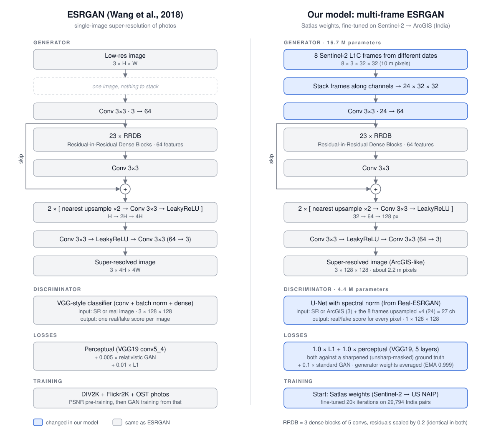

# 3. The two networks

[← 2. Data](02_data.md) · next: [4. Training](04_training.md)

Code: [`code/esrgan/networks.py`](../code/esrgan/networks.py) (networks), [`code/esrgan/model.py`](../code/esrgan/model.py)
(losses and the training step), [`code/configs/`](../code/configs/) (every setting). Weights:
[`weights/`](../weights/) (generator EMA weights, 67 MB each).



## 3.1 Two models, one architecture

| | **arcgis_B** | **s2colour** |
|---|---|---|
| output colours | ArcGIS World Imagery (the familiar basemap look) | **Sentinel-2's measured colours**, locked per 10 m cell |
| use it for | visual interpretation, digitising roads and buildings, maps | change detection, anything that compares values with Sentinel-2 |
| generator | SSR_RRDBNet, 16.7 M parameters | the same network + the colour lock (`input_lowpass`) |
| weights | `weights/arcgis_B_generator.pth` | `weights/s2colour_generator.pth` |

Both read the same input and share the same generator body; they differ in the colour lock and in how they were
trained ([4. Training](04_training.md)).

## 3.2 Generator (both models)

The ESRGAN generator (Wang et al. 2018) as adapted by Satlas for time series:

```text
input  [b, 24, 32, 32]   8 Sentinel-2 dates x RGB, 0-1, stacked on the channel axis
conv_first 3x3, 24 -> 64
23 x RRDB (Residual-in-Residual Dense Block: 3 dense blocks of 5 convs each, residual scaling 0.2, no batch norm)
conv_body 3x3 + long skip connection
upsample x2 (nearest) -> conv 3x3 -> LeakyReLU, twice               (x4 in total)
conv_hr 3x3 -> LeakyReLU -> conv_last 3x3, 64 -> 3
output [b, 3, 128, 128]  2.39 m/px
```

- **Why the dates go in as channels.** The first convolution sees all 8 dates of a pixel's neighbourhood at once, so
  the network can learn which dates agree (real structure) and which disagree (cloud, haze, a changed field) and
  how the sub-pixel shifts between them add up to detail. This is the Satlas design; the layer names and shapes are
  unchanged, so the Satlas and India checkpoints load with `strict=True`.
- **Why RRDB without batch normalisation.** From the ESRGAN paper: RRDB "without batch normalization as the basic
  network building unit" ([references](../references/README.md#1-esrgan)). Batch norm introduces artefacts in SR
  and makes the output depend on the batch.
- **EMA weights.** The released weights are the exponential moving average of the training weights (decay 0.999),
  which is smoother than any single step of GAN training. Validation and every result here use them.

## 3.3 The colour lock (s2colour only)

`SSR_RRDBNet(input_lowpass=True)` adds one operation at the end of the network:

```text
ref = per-pixel median of the 8 input dates                        [b, 3, 32, 32]   (Sentinel-2 colours)
repeat 3 times:
    diff = ref - avg_pool(out, 4)            what each 10 m cell's mean should be vs what it is
    out  = out + bicubic_upsample(diff, 4)   a smooth correction: moves the cell mean, keeps the detail
```

After three steps the mean block error falls from 12.7 to 0.25 (of 255) on validation tiles, while the detail stays
0.98 correlated with the unconstrained output. The consequence: **every 10 m cell of the output has the colour
Sentinel-2 measured there** (mean colour error vs the input 0.022 on the test set, against 0.095 for arcgis_B,
[5.3](05_evaluation.md#53-results-7-unseen-indian-places-in-season)). The network can only add detail *within*
a cell, never change what the cell measures. This is the PS's "spectral consistency", enforced by construction
rather than hoped for. It is the same idea as ESA SEN2SR's "low-frequency hard constraint layer", applied in the
spatial domain ([references](../references/README.md#9c-sen2sr-hard-constraint-abstract-only)).

## 3.4 Losses

| | **Real-ESRGAN** (x4plus) | **Satlas** (esrgan_8S2) | **arcgis_B** | **s2colour** |
|---|---|---|---|---|
| training pairs | **synthetic**: photo → blur, resize, noise, JPEG | **real**: 8 × Sentinel-2 L1C → NAIP (USA) | **real**: 8 × Sentinel-2 L2A → ArcGIS (India) | same as arcgis_B |
| generator input | 3 ch, one image | 24 ch (8 dates) | 24 ch (8 dates) | 24 ch + colour lock |
| pixel loss | L1 × 1.0 on the USM-sharpened target | same | same | same, but the target is first **shifted to the output's per-channel mean** (`colour_invariant_loss`) |
| perceptual loss | VGG19 conv1_2…conv5_4 (weights 0.1/0.1/1/1/1) × 1.0, on the sharpened target | same | same | same + the same mean shift |
| edge loss | — | — | **L1 on Sobel gradients × 0.5** (`grad_opt`) | same |
| GAN loss | vanilla × 0.1 | × 0.1 | **× 0.05** | × 0.05 |
| discriminator | U-Net + spectral norm, sees the **image only** (3 ch) | U-Net + SN + the input | U-Net + SN, sees **image + the 8 input dates** (27 ch) | same, but the image part is **high-pass only** (`disc_highpass`) |
| EMA | 0.999 | 0.999 | 0.999 | 0.999 |

Why each choice:
- **Sharpened target (USM) for L1 and perceptual, plain target for the GAN.** From Real-ESRGAN: "sharpening
  ground-truth images during training could achieve a better balance of sharpness and overshoot artifact
  suppression" ([references](../references/README.md#6-real-esrgan)).
- **U-Net discriminator with spectral normalisation.** Real-ESRGAN: it gives "detailed per-pixel feedback to the
  generator", and spectral normalisation "is also beneficial to alleviate the over-sharp and annoying artifacts
  introduced by GAN training".
- **A conditional discriminator (27 channels).** It sees the 8 input dates next to the image, so it judges "real
  *for this place*", not just "real-looking". A sharp, realistic building drawn where the Sentinel-2 stack shows a
  field is penalised.
- **Half the GAN weight + an edge loss (arcgis_B).** The GAN term is the part that invents plausible texture;
  halving it and rewarding correctly placed edges trades a little sharpness for less invention (opensr-test
  hallucination: Satlas 0.372 → arcgis_B 0.264, [5.3](05_evaluation.md#53-results-7-unseen-indian-places-in-season)).
- **Colour-blind losses (s2colour).** Every ArcGIS tile carries its own colour cast (camera, date, processing): we
  measured a mean |bias| of 7/255 on validation, 83% of it tile-by-tile. The input cannot predict that cast. So
  s2colour is not asked to: its colour comes from the input through the lock, the pixel and perceptual losses ignore
  the target's mean colour, and the discriminator sees only high frequencies. All of its training signal goes into
  detail.
- **Real pairs instead of synthetic degradation.** Real-ESRGAN learns to undo artificial blur. These models learn the
  actual relationship between Sentinel-2 and 0.3–0.5 m camera imagery (seen at 2.39 m), including atmosphere and sensor differences.

## 3.5 Confidence layer

Both models ship with a per-pixel confidence map (how much detail the model added relative to a bicubic upsample of
the input), tested against the real error: [7. Uncertainty](07_uncertainty.md).

## 3.6 Running them

```powershell
cd code
python infer.py --model s2colour --input ..\samples\input_sentinel2 --output ..\samples\output_s2colour
python infer.py --model arcgis_B --input ..\samples\input_sentinel2 --output ..\samples\output_arcgis_B
```

`samples/` contains one 4 × 4-tile chip of Hyderabad's old city (16 Sentinel-2 stacks, a test place) and both
models' outputs. `code/gis_tools.py` writes outputs as GeoTIFF (EPSG:3857) or with a world file, so they open in place
in QGIS / ArcGIS Pro.
