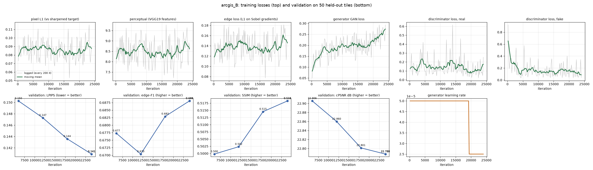
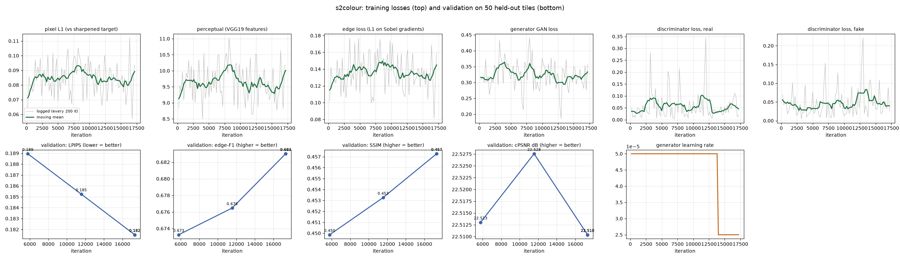
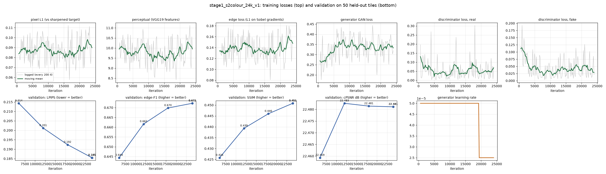
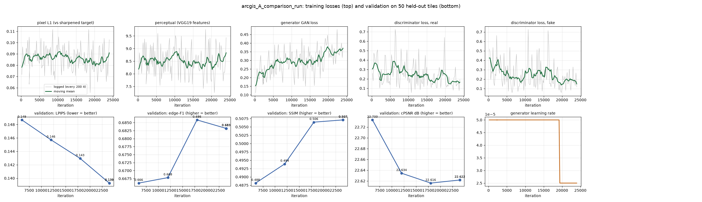

# 4. Training

[← 3. Models](03_models.md) · next: [5. Evaluation](05_evaluation.md)

Every run's settings, full log, losses (every 200 iterations) and validation metrics are in
[`training_logs/`](../training_logs/). `training_logs/plot_curves.py` redraws the curves from the CSVs.

## 4.1 Lineage

```text
Satlas esrgan_8S2 (Allen AI; 1.2 M US pairs: 8 x Sentinel-2 L1C -> NAIP)
   └─ India 20k        15 Indian places, L1C, ~30k tiles, 20k iterations, batch 12, new discriminator
        ├─ run A       55 places, L2A, 103,936 tiles, 24k it, the Satlas loss recipe unchanged   (comparison run)
        └─ arcgis_B    OUR MODEL (ArcGIS colours): same data, GAN 0.05 + edge loss 0.5
             └─ s2colour stage 1   colour lock + colour-blind losses, 24k it (its 18k checkpoint kept)
                  └─ s2colour      OUR MODEL (Sentinel-2 colours): +17,322 it (2 epochs) from that checkpoint
```

| | India 20k | run A (comparison) | **arcgis_B** | **s2colour** |
|---|---|---|---|---|
| start | Satlas G; new D | India 20k G **and** D | India 20k G and D | stage 1: arcgis_B G + a fresh high-pass D (500 D-only iterations); stage 2: stage 1 @ 18k (G and D) |
| data | 15 places, L1C | 55 places, L2A, 103,936 tiles | same | same |
| iterations × batch | 20,000 × 12 | 24,000 × 12 (288k images) | 24,000 × 12 | 24,000 (stage 1) + 17,322 × 12 |
| learning rate G / D | 5e-5 / 1e-4 | 5e-5 / 1e-4, halved at 80% | same | same |
| GAN weight | 0.1 | 0.1 | **0.05** | 0.05 |
| edge (Sobel) loss | — | — | **0.5** | 0.5 |
| colour | ArcGIS | ArcGIS | ArcGIS | **Sentinel-2 (locked)** |
| wall time (RTX 5060 laptop, 8 GB) | 2 h 42 min | 2 h 39 min | 2 h 47 min | 3 h 05 min + 2 h 02 min |
| config | — | [`arcgis_A.yml`](../code/configs/arcgis_A.yml) | [`arcgis_B.yml`](../code/configs/arcgis_B.yml) | [`s2colour_stage1.yml`](../code/configs/s2colour_stage1.yml) → [`s2colour.yml`](../code/configs/s2colour.yml) |

Shared settings: Adam (β 0.9 / 0.99), EMA of the generator weights (0.999), the same random flip / 90° rotation
applied to input and target, 8 frames drawn at random per tile per step (when a tile has more than 8 clean dates),
6 data-loading workers (3 for s2colour: Windows commits ~2.5 GB per worker), 0.40 s per iteration, peak 6.1 GB VRAM.

**Why a learning-rate of 5e-5.** Phase 1's test over 3,000 iterations: 2e-5 → val PSNR 21.30, 5e-5 → 21.47,
1e-4 → 21.51. 1e-4 was marginally ahead early but less stable for GAN training over a full run; 5e-5 was kept for
the generator, with 1e-4 for the discriminator.

## 4.2 Validation during training (50 tiles from places the starting model never saw)

| run | iteration | cPSNR | PSNR | SSIM | LPIPS ↓ | edge-F1 | grad-corr |
|---|---|---|---|---|---|---|---|
| run A | 6,000 | 22.73 | 21.01 | 0.488 | 0.149 | 0.666 | 0.358 |
| run A | 24,000 | 22.62 | 21.21 | 0.507 | **0.139** | 0.683 | 0.379 |
| **arcgis_B** | 6,000 | **22.91** | 21.22 | 0.500 | 0.150 | 0.677 | 0.366 |
| **arcgis_B** | 24,000 | 22.79 | **21.31** | **0.518** | 0.141 | **0.688** | **0.391** |
| **s2colour** | 5,774 | 22.51 | 18.05 | 0.450 | 0.189 | 0.673 | 0.365 |
| **s2colour** | 17,322 | 22.51 | 18.07 | 0.457 | 0.182 | 0.683 | 0.370 |

- **s2colour's PSNR and LPIPS here are measured against the ArcGIS-coloured target**, which it is deliberately
  not trying to match (its colours are Sentinel-2's). They understate it by design. The colour-normalised test
  metrics in [5.3](05_evaluation.md#53-results-7-unseen-indian-places-in-season) compare like with like.
- **The perception–distortion trade-off is visible in our own logs.** During arcgis_B's run, cPSNR *fell*
  (22.91 → 22.79) while every structural and perceptual metric *improved* (LPIPS 0.150 → 0.141, edge-F1 0.677 →
  0.688, gradient correlation 0.366 → 0.391, SSIM 0.500 → 0.518). The model was getting sharper and more correct
  in structure, and the shift-and-brightness-tolerant pixel metric scored that as worse. This is exactly what Blau &
  Michaeli prove must happen ([5.1](05_evaluation.md#51-why-psnr-and-ssim-are-not-the-headline)).

## 4.3 Curves

| run | curves |
|---|---|
| arcgis_B |  |
| s2colour |  |
| s2colour stage 1 |  |
| run A (comparison) |  |

How to read them:
- **The generator losses do not fall steadily, and should not.** This is fine-tuning of an already-trained GAN on
  new data, and the discriminator trains alongside: as the generator improves, the discriminator gets better at
  spotting it, and the generator's GAN loss *rises* (arcgis_B: 0.08 → 0.27). The pixel and perceptual losses stay
  flat within noise because the target (a different camera on a different day) cannot be matched pixel for pixel.
  Progress is measured on validation (bottom rows), where it is monotonic in LPIPS, SSIM and gradient correlation.
- **The learning rate halves at 80%** (step in the bottom-right panel); the last validation after it is the kept
  checkpoint.
- **s2colour stage 1** (the first 24k iterations with the colour lock): log, losses, validation and curves in
  [`training_logs/s2colour/stage1_s2colour_24k_v1/`](../training_logs/s2colour/stage1_s2colour_24k_v1/) (extracted
  from the pipeline log; its losses start at iteration 600, after the discriminator warm-up).
  Its validation was still improving at 18k (LPIPS 0.214 → 0.201 → 0.192 → 0.185, edge-F1 0.644 → 0.662 → 0.670 →
  0.672), so the 18k checkpoint, taken before its learning rate halved, was continued for two more epochs at the
  full rate.

## 4.4 Reproducing a run

```powershell
cd code
python pipeline.py --dry-run                         # the 10 steps
python pipeline.py                                   # everything: data, three training runs, evaluation
python train.py -opt configs/arcgis_B.yml            # one run (needs data/training and the India 20k weights)
python train.py -opt configs/arcgis_A.yml --debug --force_yml train:total_iter=120    # 5-minute smoke test
```

Data collection needs Copernicus Data Space credentials (`code/.env.example`). Each training run takes about
2.7 h on an RTX 5060 laptop GPU.
