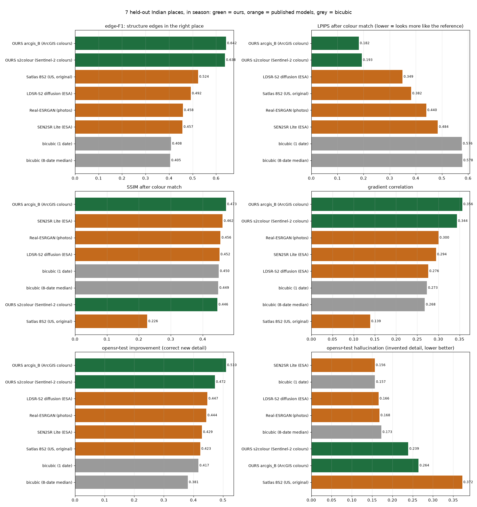

# 5. Evaluation

[← 4. Training](04_training.md) · next: [6. Geospatial consistency](06_geospatial_consistency.md)

**Test set:** 2,800 tiles from **7 Indian places the models never saw** (≥ 54 km from any training tile), scored
against ArcGIS imagery at 2.39 m/px (zoom 17, resampled from 0.31–0.5 m captures). Every number here is in
[`results/benchmark/metrics/`](../results/benchmark/metrics/) (`summary.csv` per model and per place,
`tiles.csv` per tile, `chips.csv` per opensr-test chip); every figure in
[`results/benchmark/figures/`](../results/benchmark/figures/).

## 5.1 Why PSNR and SSIM are not the headline

PSNR measures the average squared pixel difference to the reference. When the exact position of a fine detail is
uncertain (and at 10 m → 2.4 m it always is), the image that minimises the average squared error is the **blurred
average** of all plausible answers. PSNR therefore rewards blur, and punishes a sharp, correct-looking edge that is
one pixel off twice: once where it is, once where it should have been. This is not our opinion; it is one of the
best-established results in super-resolution:

> "In this paper, we prove mathematically that distortion and perceptual quality are at odds with each other."
> — Blau & Michaeli, *The Perception-Distortion Tradeoff*, CVPR 2018, abstract

> "As opposed to the common belief, this result holds true for any distortion measure, and is not only a problem of
> the PSNR or SSIM criteria."
> — Blau & Michaeli 2018, abstract

> "However, these PSNR-oriented approaches tend to output over-smoothed results without sufficient high-frequency
> details, since the PSNR metric fundamentally disagrees with the subjective evaluation of human observers [1]."
> — Wang et al., *ESRGAN*, ECCV-W 2018, §1

> "We have further shown that standard quantitative measures such as PSNR and SSIM fail to capture and accurately
> assess image quality with respect to the human visual system [56]."
> — Ledig et al., *SRGAN*, CVPR 2017, §4

> "Despite this, the most widely used perceptual metrics today, such as PSNR and SSIM, are simple, shallow
> functions, and fail to account for many nuances of human perception."
> — Zhang et al., *LPIPS*, CVPR 2018, abstract

And specifically for **satellite** super-resolution, from the Satlas authors, whose model we started from:

> "Finding 1. PSNR and SSIM, the most widely used metrics, are insufficient and poorly correlate with human
> judgments. The correspondences between human preferences and those computed by the standard SUPER-RES metrics,
> PSNR, SSIM, and cPSNR, are very low, as shown in Figure 3."
> — Wolters, Bastani & Kembhavi, *Zooming Out on Zooming In*, 2023, §3.1

> "Note that the four images are ordered from best to worst based on human preference, and PSNR and SSIM increase
> in an opposite trend."
> — ibid., Figure 2 caption

> "The authors observed that the peak signal-to-noise ratio (PSNR) and structural similarity index (SSIM) do not
> correlate well with the quality of the reconstructed images–the highest scores were obtained for blurred images
> in which the details were not reconstructed accurately."
> — Kowaleczko et al., *A Real-World Benchmark for Sentinel-2 Multi-Image Super-Resolution*, Scientific Data 2023

> "On the one hand, pixelwise metrics can be too sensitive to spatial translations and local reflectance
> disparities unrelated to the SR problem [9]. On the other hand, perceptual metrics are not specifically intended
> for SR."
> — Aybar et al., *A Comprehensive Benchmark for Optical Remote Sensing Image Super-Resolution* (opensr-test), IEEE
> GRSL 2024, §I

Full citations, page numbers and more quotes: [`references/README.md`](../references/README.md).

**We see the same thing in our own results.** Rank the 8 models on the test set by cPSNR, then by what the image
actually shows:

| rank by cPSNR ↑ | cPSNR | | rank by LPIPS ↓ (colour-normalised) | LPIPS | edge-F1 ↑ |
|---|---|---|---|---|---|
| 1. SEN2SR Lite (ESA) | 20.88 | | 1. **OURS arcgis_B** | **0.182** | **0.642** |
| 2. LDSR-S2 diffusion (ESA) | 20.87 | | 2. **OURS s2colour** | **0.193** | **0.638** |
| 3. bicubic (1 date) | 20.78 | | 3. LDSR-S2 diffusion | 0.349 | 0.492 |
| 4. Real-ESRGAN | 20.67 | | 4. Satlas (original) | 0.382 | 0.524 |
| 5. bicubic (8-date median) | 20.58 | | 5. Real-ESRGAN | 0.440 | 0.458 |
| 6. OURS s2colour | 20.41 | | 6. SEN2SR Lite | 0.484 | 0.457 |
| 7. OURS arcgis_B | 20.39 | | 7. bicubic (1 date) | 0.576 | 0.408 |
| 8. Satlas (original) | 16.99 | | 8. bicubic (8-date median) | 0.578 | 0.405 |

**Plain bicubic interpolation outranks both our models on cPSNR.** Nobody would call bicubic a better
super-resolution. Look at [`figures/06_visual_vs_published/`](../results/benchmark/figures/06_visual_vs_published/):
the top-cPSNR model's output is a soft version of the 10 m input. The literature predicts exactly this ordering, and
it happens on our data. We also saw it during training: arcgis_B's validation cPSNR fell 22.91 → 22.79 while LPIPS,
SSIM, edge-F1 and gradient correlation all improved ([4.2](04_training.md#42-validation-during-training-50-tiles-from-places-the-starting-model-never-saw)).

**The counterpoint, taken seriously.** For scientific use, pixel values matter:

> "However, this human perception bias makes them less applicable to scientific EO tasks, where the visual
> representation might be less important than, for example, accurate pixel values."
> — Märtens et al., *Super-Resolution of PROBA-V Images*, 2019, §4

That is why we do **not** use perceptual metrics alone. Radiometric fidelity is handled separately and explicitly:
s2colour locks every 10 m cell to Sentinel-2's measured colour ([3.3](03_models.md#33-the-colour-lock-s2colour-only)),
and opensr-test's *reflectance* and *spectral* consistency scores check it ([5.3](#53-results-7-unseen-indian-places-in-season), [5.7](#57-outside-india-esas-opensr-test-benchmark-spanish-cities)).
PSNR, SSIM and cPSNR are reported for every model; they are just not used to rank.

## 5.2 The metrics we use

| metric | what it asks | why |
|---|---|---|
| **edge-F1** | are the structure edges (Canny after a 2 px blur, 1 px tolerance) where the reference's are? | directly the PS's "narrow roads, small buildings, field boundaries"; colour-blind, so fair to both colour conventions |
| **gradient correlation** | do edges have the reference's strength and orientation? | sharpness that is in the right place |
| **LPIPS** (colour-normalised) | does it look like the reference to a deep network trained on human judgements? | the standard perceptual metric (Zhang et al. 2018) |
| **cPSNR** | PSNR after the best shift (≤ 8 px) and per-channel brightness offset | the PROBA-V challenge metric; removes misregistration and per-tile colour noise of the reference; **still favours blur** |
| PSNR, SSIM | pixel agreement | reported for completeness |
| **opensr-test** (ESA) | *improvement* (new detail close to the reference), *omission* (detail missed), *hallucination* (detail far from both input and reference); *reflectance*, *spectral*, *spatial* consistency with the input | a benchmark designed for remote-sensing SR; the three correctness scores sum to 1 per model, so read them **against the bicubic row** |

**Colour fairness.** ArcGIS colours are a convention, not a measurement, and half the models output Sentinel-2
colours. So the headline metrics are colour-blind (edge-F1, gradient correlation) or colour-normalised (`cn_*`: each
output's per-channel mean and spread matched to the reference before scoring). opensr-test histogram-matches every
output to the reference before its correctness scores.

## 5.3 Results: 7 unseen Indian places, in season

Tile metrics are per 128 px tile (2,800 tiles). opensr-test runs on 117 chips of 4 × 4 tiles (128 px in, 512 px out).

| model | edge-F1 ↑ | grad-corr ↑ | LPIPS (cn) ↓ | SSIM (cn) ↑ | PSNR (cn) ↑ | improvement ↑ | omission ↓ | hallucination ↓ | colour vs input ↓ |
|---|---|---|---|---|---|---|---|---|---|
| **OURS arcgis_B** (ArcGIS colours) | **0.642** | **0.356** | **0.182** | **0.473** | 20.15 | **0.510** | 0.226 | 0.264 | 0.095 |
| **OURS s2colour** (Sentinel-2 colours) | 0.638 | 0.344 | 0.193 | 0.446 | 19.82 | 0.472 | 0.288 | 0.239 | 0.022 |
| Satlas 8S2 (US, original; our starting point) | 0.524 | 0.139 | 0.382 | 0.226 | 17.09 | 0.423 | **0.204** | 0.372 | 0.189 |
| LDSR-S2 latent diffusion (ESA) | 0.492 | 0.276 | 0.349 | 0.452 | 20.44 | 0.447 | 0.387 | 0.166 | 0.009 |
| Real-ESRGAN general x4v3 | 0.458 | 0.300 | 0.440 | 0.456 | 20.34 | 0.444 | 0.388 | 0.168 | 0.016 |
| SEN2SR Lite (ESA) | 0.457 | 0.294 | 0.484 | 0.462 | **20.47** | 0.429 | 0.415 | **0.156** | **0.005** |
| bicubic (1 date) | 0.408 | 0.273 | 0.576 | 0.450 | 20.34 | 0.417 | 0.426 | 0.157 | 0.007 |
| bicubic (8-date median) | 0.405 | 0.268 | 0.578 | 0.449 | 20.10 | 0.381 | 0.446 | 0.173 | 0.008 |



How to read it:
- **Structure and perceptual quality: both our models lead by a wide margin.** Edge-F1 0.64 against the best
  other model's 0.52; LPIPS 0.18–0.19 against the best other's 0.35.
- **The single-image models add little, so they invent little.** Their hallucination (0.16–0.17) and omission
  (0.39–0.42) sit next to bicubic's (0.157, 0.426). Ours add the most correct detail (improvement 0.47–0.51, lowest
  omission after Satlas) at the price of more invented detail (0.24–0.26). The original Satlas invents far more
  (0.372) and gets less right (0.423): fine-tuning on Indian data moved both in the right direction.
  [`figures/02_hallucination_vs_improvement.png`](../results/benchmark/figures/02_hallucination_vs_improvement.png).
- **Colour.** s2colour stays within 0.022 of the input's colours; arcgis_B is at 0.095 *by design* (it outputs
  ArcGIS colours). ESA's models are closest (0.005–0.009) because they add the least.
- The opensr-test *spatial* column is discussed separately, because it does not measure what its name suggests for
  models that add detail: [6. Geospatial consistency](06_geospatial_consistency.md).

## 5.4 Per place

Edge-F1, in season ([`figures/03_edge_f1_per_place.png`](../results/benchmark/figures/03_edge_f1_per_place.png)):

| place | kind | arcgis_B | s2colour | best published model | bicubic (1 date) |
|---|---|---|---|---|---|
| Hyderabad old city | urban | 0.776 | **0.784** | 0.649 (Satlas) | 0.495 |
| Varanasi ghats | urban | **0.714** | 0.692 | 0.610 (Satlas) | 0.377 |
| Barmer | desert | **0.739** | 0.717 | 0.584 (Satlas) | 0.442 |
| Shillong | hills | 0.708 | **0.710** | 0.581 (Satlas) | 0.433 |
| Thanjavur | paddy | **0.634** | 0.613 | 0.530 (LDSR-S2) | 0.418 |
| Wayanad | forest | 0.535 | **0.554** | 0.536 (LDSR-S2) | 0.451 |
| Lachung, North Sikkim | snow | 0.389 | **0.393** | 0.327 (Satlas) | 0.241 |

One of our models leads at every place; LPIPS is lowest for ours at every place as well. **Wayanad forest is the
closest call** (dense canopy has few sharp edges for any model to recover), and **snow is hard for everyone**: the
reference and the Sentinel-2 dates rarely agree on snow cover.

## 5.5 Dates far from the reference (off season)

The same tiles with Sentinel-2 dates about 6 months from the reference capture, so crops, water and snow have
changed ([`figures/04_inseason_vs_offseason.png`](../results/benchmark/figures/04_inseason_vs_offseason.png)):

| model | edge-F1 | grad-corr | LPIPS (cn) | SSIM (cn) | improvement | omission | hallucination |
|---|---|---|---|---|---|---|---|
| **OURS arcgis_B** | 0.570 | 0.288 | 0.214 | 0.400 | 0.455 | 0.268 | 0.277 |
| **OURS s2colour** | 0.566 | 0.281 | 0.224 | 0.382 | 0.419 | 0.334 | 0.247 |
| Satlas 8S2 (original) | 0.486 | 0.107 | 0.406 | 0.199 | 0.405 | 0.246 | 0.348 |
| bicubic (8-date median) | 0.350 | 0.219 | 0.590 | 0.407 | 0.354 | 0.441 | 0.205 |

Both models lose about 0.07 edge-F1 and 0.03 LPIPS, partly because the ground really changed. Even off season they
are ahead of every in-season published model.

## 5.6 What the 8 dates buy

The same tiles and weights, fed 1, 2, 4 or 8 dates (nearest the reference first, repeated to fill the 8 input slots)
([`figures/09_dates_ablation.png`](../results/benchmark/figures/09_dates_ablation.png)):

| model | dates | edge-F1 ↑ | grad-corr ↑ | LPIPS (cn) ↓ | SSIM (cn) ↑ |
|---|---|---|---|---|---|
| arcgis_B | 1 | 0.620 | 0.292 | 0.216 | 0.444 |
| arcgis_B | 2 | 0.632 | 0.323 | 0.182 | 0.449 |
| arcgis_B | 4 | 0.646 | 0.352 | 0.179 | 0.471 |
| arcgis_B | 8 | 0.642 | 0.356 | 0.182 | 0.473 |
| s2colour | 1 | 0.600 | 0.261 | 0.232 | 0.415 |
| s2colour | 2 | 0.619 | 0.302 | 0.198 | 0.418 |
| s2colour | 4 | 0.637 | 0.337 | 0.194 | 0.444 |
| s2colour | 8 | 0.638 | 0.344 | 0.194 | 0.447 |

- **Most of the gap to published models comes from training, not from the dates.** With a single date, both
  models already score 0.60–0.62 edge-F1, ahead of every single-image model (best 0.49).
- **The dates add a real, moderate gain**: from 1 to 8 dates, gradient correlation +0.06 to +0.08, LPIPS −0.03 to
  −0.04, edge-F1 +0.02 to +0.04. Most of it arrives by 4 dates, matching WorldStrat's report of "a clear
  improvement when going from 4 revisits to 8, but only minor diminishing returns when increasing to 16".
- **So a single clear date is enough for rapid response** (a flood the day after), at a measured cost of about
  0.03 LPIPS.

## 5.7 Outside India: ESA's opensr-test benchmark (Spanish cities)

opensr-test's own dataset: 10 scenes of Spanish cities, Sentinel-2 against the Spanish national aerial orthophoto
(PNOA, 2.5 m). Our models were not tuned for Spain. Per-scene values:
[`results/benchmark/opensr_test_spain_urban.json`](../results/benchmark/opensr_test_spain_urban.json).

| model | reflectance ↓ | spectral (°) ↓ | spatial (LR px) ↓ | improvement ↑ | omission ↓ | hallucination ↓ |
|---|---|---|---|---|---|---|
| **OURS arcgis_B** | 0.0317 | 4.306 | 0.064 | **0.297** | **0.246** | 0.457 |
| **OURS s2colour** | 0.0066 | 0.723 | 0.063 | 0.255 | 0.456 | **0.289** |
| SEN2SR Lite (ESA) | 0.0289 | 0.671 | **0.006** | 0.193 | 0.421 | 0.386 |

Both our models add more correct detail than ESA's model outside India, and s2colour also invents less and keeps
reflectance 4× closer. arcgis_B's spectral error is by design (ArcGIS colours). The *spatial* column: see
[6.4](06_geospatial_consistency.md#64-why-opensr-tests-spatial-score-reports-drift-that-is-not-there).

## 5.8 Visual comparison

For each place, the three tiles with the most structure in the reference, at 2× zoom:
- [`figures/05_visual_ours_vs_baselines/<place>.png`](../results/benchmark/figures/05_visual_ours_vs_baselines/):
  reference | 8-date input | bicubic | Satlas original | arcgis_B | s2colour.
- [`figures/06_visual_vs_published/<place>.png`](../results/benchmark/figures/06_visual_vs_published/):
  reference | 1-date input | arcgis_B | s2colour | SEN2SR | LDSR-S2 | Real-ESRGAN.


In Hyderabad's old city our models draw the street grid and building blocks where the reference has them; the
single-image models return a soft version of the 10 m input.

## 5.9 How the published models were run (fairness)

| model | what it is | parameters | notes |
|---|---|---|---|
| Satlas 8S2 | the model we started from: 8-date ESRGAN trained on US NAIP | 16.7 M | official weights, same 8 dates as ours |
| SEN2SR Lite (ESA) | CNN + a "hard constraint" that rebuilds low frequencies from the input | 0.57 M | trained on US NAIP; official weights (CC0) |
| LDSR-S2 (ESA) | latent diffusion, 100 DDIM steps | 169 M | trained on US NAIP; ~5 s per 128 px patch; fixed seed |
| Real-ESRGAN general x4v3 | generic photo model | 1.2 M | out of domain; reflectance above 0.356 clips |

- Each was run **the way its authors run it**: their inference code was read and followed (band order, scaling,
  tiling, clamping). Loaders and notes quoting the lines followed:
  [`code/published_models/loaders/`](../code/published_models/loaders/). Weights download automatically on first use.
- Every single-image model gets the Sentinel-2 L2A date **nearest each tile's reference capture**, with the 4 bands
  it asks for (B02, B03, B04, B08), on **4 × 4-tile chips (128 px in)** so it has real context rather than padding.
- Our models get the 8 dates they were built for; [5.6](#56-what-the-8-dates-buy) measures what that is worth,
  and two bicubic baselines (1 date, 8-date median) are reported.

## 5.10 How the architecture was chosen (phase 2)

Before the main training, the candidate architectures were measured on 4 Indian places none of them had trained on
(Hyderabad old city, Varanasi ghats, Thanjavur paddy, Barmer desert; one 512 × 512 px scene, 1.2 km square, each).
All data, per-site scores and a sheet per site with every output:
[`results/architecture_comparison/`](../results/architecture_comparison/).

Two comparisons in one:
- **7 published models as released** and our India fine-tune, plus bicubic.
- **11 quick fine-tunes** of them: each fine-tuned for **one epoch on the same 18,794 Indian tiles** (1–19 min),
  with recipe A (L1 + perceptual + GAN, discriminator sees the input) and, where it applies, recipe B (the model's own
  loss, or a discriminator that sees the image only). This is the **equal-budget** comparison of architectures.

Mean over the 4 sites, sorted by LPIPS (full table: `summary_by_model.csv`):

| model | input | LPIPS ↓ | cPSNR ↑ | SSIM ↑ | LPIPS rank at each site |
|---|---|---|---|---|---|
| **India fine-tune of Satlas 8-frame ESRGAN** (became arcgis_B's start) | 8 dates | **0.171** | 18.18 | **0.445** | **1, 1, 1, 1** |
| Satlas ESRGAN 2-frame, 1-epoch fine-tune | 2 dates | 0.211 | 16.92 | 0.349 | 2, 2, 6, 3 |
| Satlas ESRGAN 8-frame, 1-epoch fine-tune | 8 dates | 0.217 | 17.34 | 0.377 | 4, 4, 8, 2 |
| Satlas ESRGAN 1-frame, 1-epoch fine-tune | 1 date | 0.218 | 16.99 | 0.308 | 5, 3, 7, 4 |
| Real-ESRGAN x4plus, 1-epoch fine-tune (B) | median of 8 | 0.253 | 17.85 | 0.394 | 3, 8, 2, 5 |
| SwinIR-L (Swin transformer), 1-epoch fine-tune (B) | median of 8 | 0.280 | 18.01 | 0.387 | 7, 9, 4, 7 |
| Satlas ESRGAN 2-frame (US, as released) | 2 dates | 0.299 | 15.80 | 0.261 | 9, 5, 11, 9 |
| ESA LDSR-S2 (latent diffusion, as released) | 1 date | 0.415 | 17.90 | 0.326 | 12, 11, 9, 11 |
| Swin2-MoSE (Swin transformer + mixture of experts), 1-epoch fine-tune (A) | 1 date | 0.484 | **18.59** | 0.394 | 14, 12, 14, 14 |
| Real-ESRGAN x4plus (as released) | median of 8 | 0.486 | 17.08 | 0.242 | 11, 17, 16, 12 |
| ESA SEN2SR Lite, 1-epoch fine-tune (A) | 1 date | 0.495 | 17.98 | 0.340 | 15, 13, 12, 15 |
| SwinIR-L (as released) | median of 8 | 0.510 | 17.30 | 0.256 | 13, 18, 18, 13 |
| ESA SEN2SR Lite (as released) | 1 date | 0.546 | 17.94 | 0.329 | 18, 16, 15, 17 |
| Swin2-MoSE (as released) | 1 date | 0.615 | 18.03 | 0.315 | 19, 19, 19, 19 |
| bicubic | median of 8 | 0.675 | 17.30 | 0.236 | 20, 20, 20, 20 |

(Site order in the last column: Hyderabad, Varanasi, Thanjavur, Barmer. The remaining fine-tune variants are in the
CSV; each is close to its sibling above.)

What decided the architecture:
- **The multi-date ESRGAN was first on LPIPS at every site**, and ahead of every other model on SSIM.
- **At equal budget, the ESRGAN family still leads.** Given the same one epoch on the same Indian tiles, the three
  Satlas ESRGAN fine-tunes (LPIPS 0.211–0.218) beat Real-ESRGAN (0.253), the SwinIR transformer (0.280), Swin2-MoSE
  (0.484) and SEN2SR (0.495). So the choice does not rest only on India 20k's longer training.
- **The best cPSNR belonged to a soft model.** Swin2-MoSE fine-tuned with recipe A had the top cPSNR (18.59,
  +0.41 dB over the India fine-tune) with LPIPS 0.484: the perception–distortion trade-off of
  [5.1](#51-why-psnr-and-ssim-are-not-the-headline) again. In the sheets its output is visibly soft.
- **The transformers did not help at this input size.** SwinIR and Swin2-MoSE attend within windows; a 32 × 32 px
  Sentinel-2 tile holds only a few windows, and single-image transformers cannot use the 8 dates.

Caveats: 4 scenes are a small sample (the final evaluation above uses 2,800 tiles from 7 places); the input was still
L1C for most models (the switch to L2A came a day later); and the India fine-tune had far more training than the
1-epoch fine-tunes, which is why the equal-budget rows matter.

## 5.11 Reproducing

```powershell
cd code
python ps_proof.py audit          # data + leak audit                   (~10 min, CPU)
python ps_proof.py score          # every model on the 7 test places    (~1.5 h on an RTX 5060)
python ps_proof.py uncertainty    # confidence layer vs real error      (~10 min)
python ps_proof.py frames         # 1 / 2 / 4 / 8 dates                  (~15 min)
python ps_proof.py figures
```

Needs `code/data/test/` (from `python pipeline.py --only test_data`) and the trained checkpoints.
