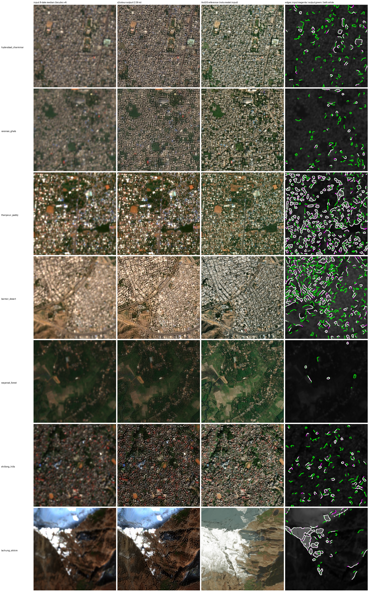

# 6. Geospatial consistency: why 8 dates keep the geometry instead of blurring it

[← 5. Evaluation](05_evaluation.md) · next: [7. Uncertainty](07_uncertainty.md)

Scripts, per-chip numbers and figures: [`results/geospatial/`](../results/geospatial/).

## 6.1 The intuition, and why it is wrong

The PS asks for output that preserves "the original geographic ... consistency of the satellite data". The
intuitive objection to a multi-date model is:

> *"The 8 dates were taken days or weeks apart. Each has its own small geolocation error. Stacking them must blur
> the image or shift it. A single-date model should be more faithful to the ground."*

It sounds right and it is backwards, for three reasons, each measured below:

1. **Sentinel-2 dates are co-registered far better than a pixel**, by ESA's specification and measured performance
   ([6.2](#62-fact-1-sentinel-2-dates-are-co-registered-to-a-fraction-of-a-pixel)), and on our own test data each
   date sits on average **0.027 px (0.26 m)** from the 8-date consensus.
2. **The small differences that remain are information, not error.** Sub-pixel offsets between looks at the same
   ground are exactly what multi-image super-resolution uses to recover detail finer than one pixel
   ([6.3](#63-fact-2-the-sub-pixel-differences-between-dates-are-the-signal)).
3. **A single date is one sample of the position; eight dates are eight samples.** A single-image model inherits
   whatever offset its one date has. A multi-date model sees their consensus, and our output follows that consensus
   to **0.010 px (0.1 m)** once the effect of added detail on the measurement is removed
   ([6.4](#64-why-opensr-tests-spatial-score-reports-drift-that-is-not-there)).

## 6.2 Fact 1: Sentinel-2 dates are co-registered to a fraction of a pixel

ESA's requirement and measured performance for multi-temporal registration:

> "The spatial co-registration accuracy of Level 1 c data acquired at different dates over the same geographical
> area shall be better than or equal to 0.3 SSD at 2 σ confidence level."
> — ESA Sentinel-2 Mission Performance Centre, *Sentinel-2 L1C Data Quality Report*, issue 71 (2022), Table 2-1
> ("SSD" = spatial sampling distance, i.e. one pixel)

> "Figure 4 below shows the histograms of the co-registration for pairs of S2A, S2B and S2A/S2B products. The
> performance for all cases is 0.4 pixels at 95.45%."
> — ibid., §2.2.5.3 (refined products, which is what L2A is built from)

**Measured on our data** ([`results/geospatial/date_registration.py`](../results/geospatial/date_registration.py),
per-date values in `date_registration.csv`): for every 4 × 4-tile chip of the test places whose 16 tiles share the
same 8 dates (39 chips, 312 date × chip measurements), each date's image was phase-correlated (1/50 px precision)
against the per-pixel median of the 8 dates, after a 1 px blur so the estimate follows position and not cloud or
crop texture:

| | offset of a single date from the 8-date consensus |
|---|---|
| mean | **0.027 px = 0.26 m** |
| median | 0.020 px |
| 90th percentile | 0.060 px = 0.57 m |
| worst of 312 | 0.201 px = 1.9 m |

Per place, the mean ranges from 0.016 px (Shillong) to 0.042 px (Hyderabad). So the 8 dates we stack are aligned
to a few percent of a pixel. Stacking them cannot blur the geometry at the scale of our 2.39 m output; the
occasional date that is off by 0.1–0.2 px is outvoted by the other seven.

## 6.3 Fact 2: the sub-pixel differences between dates are the signal

> "When an image is down-sampled to a lower resolution, its high-frequency details are lost permanently and cannot
> be recovered from any image in isolation. However, by combining multiple low-resolution images, it is possible
> to recover the original scene at a higher resolution."
> — Deudon et al., *HighRes-net: Recursive Fusion for Multi-Frame Super-Resolution of Satellite Imagery*, 2020, §1

> "While SISR is a mathematically ill-posed problem, in which lost pixel-information is somewhat imputed to
> generate a plausible and pleasing visual outcome, challenges in MISR can have a different objective: provided the
> multiple images are not exactly identical, subpixel differences may allow to obtain actual information on the
> ground truth image. This makes the approach particularly attractive for EO satellites as it allows to enhance
> their payload capabilities keeping the information content of the newly created pixel values linked to real
> observations."
> — Märtens et al., *Super-Resolution of PROBA-V Images Using Convolutional Neural Networks*, 2019, §2.2

> "SISR models often produce sharp, visually appealing results, but are prone to artifacts and hallucinated
> structures that do not depict the real situation. MISR models, on the other hand, tend to remain more faithful to
> the physical signal by relying on multiple samples of it."
> — Retnanto et al., *Beyond Pretty Pictures: Combined Single- and Multi-Image Super-resolution for Sentinel-2
> Images*, 2025, §1

So the tiny offsets of 6.2 are not a defect to be averaged away; they are what lets 8 dates at 10 m carry
information about structure below 10 m. The ablation in [5.6](05_evaluation.md#56-what-the-8-dates-buy) measures it
on our models: gradient correlation +0.06 to +0.08 and LPIPS −0.03 to −0.04 from 1 to 8 dates.

## 6.4 Why opensr-test's spatial score reports drift that is not there

opensr-test's *spatial* score (package v1.3.3) averages the super-resolved image back down to 10 m,
phase-correlates it with the input, and reports the **length** √(dx² + dy²) of the shift it finds. Our models score
0.13–0.18 input pixels on it; bicubic and the single-image models score ≈ 0. Taken at face value that is a 1.3–1.7 m
shift. **It is not a shift.** Two properties of the measurement produce it:

- The downsampled output of a model that adds detail is not identical to the input: the new detail leaves a
  residue at the coarse scale that phase correlation reads as a small displacement.
- A length is never negative, so noise in the estimate always adds up as "drift", never cancels.

A model that adds nothing (bicubic, and single-image models that stay close to it) gets ≈ 0 trivially.

**The test** ([`results/geospatial/drift_check.py`](../results/geospatial/drift_check.py), per-chip values in
`drift_check.csv`). On all 117 test chips we measured (a) opensr-test's own score, (b) the *signed* shift, and (c)
the shift after blurring both images (σ = 1.5 input px), which removes the fine detail and keeps position: a real
translation survives a blur, a detail artefact does not. As a **control** we built an image whose position is
correct by construction: bicubic upsampling of the input plus the *real* high-frequency detail of the reference.

| (input pixels) | opensr-test "drift" | signed mean shift (dy, dx) | after blur |
|---|---|---|---|
| **control**: bicubic + real reference detail, true shift = 0 | **0.116** | (+0.046, +0.008) | **0.021** |
| bicubic (8-date median) | 0.001 | (−0.001, 0.000) | 0.000 |
| **s2colour** | 0.133 | (+0.116, +0.054) | **0.010** |
| **arcgis_B** | 0.179 | (+0.154, +0.054) | **0.121** (mean +0.078, +0.018) |

What it shows:
- **Adding correct detail with zero shift already scores 0.116**, nearly all of s2colour's 0.133. The metric
  penalises detail, not displacement.
- **s2colour has no measurable shift**: 0.010 px (≈ 0.1 m) after the blur, the same as the zero-shift control.
  Its colour lock ([3.3](03_models.md#33-the-colour-lock-s2colour-only)) forces every 10 m cell's mean onto the
  input, which pins position as well as colour.
- **arcgis_B keeps a small real shift of about 0.08 px (≈ 0.75 m), mostly north–south.** It is inherited from its
  training targets, not a network error: measured at full resolution against the ArcGIS reference, bicubic is offset
  by (+0.24, +0.26) input px, and arcgis_B has moved most of the way towards the ArcGIS position in y (+0.06). ArcGIS
  imagery has its own registration (stated positional accuracy 2–8.5 m in the tile metadata, 5 m for most test
tiles) and building shadows, and a
  model trained to look like ArcGIS partly learns them. **For work that must overlay other Sentinel-2-aligned layers
  exactly, use s2colour.**

The same effect explains the Spanish-cities score (0.063–0.064, [5.7](05_evaluation.md#57-outside-india-esas-opensr-test-benchmark-spanish-cities)).

## 6.5 See it

One 4 × 4-tile chip per test place (the one with the most structure). Columns: the 8-date input (bicubic ×4) |
s2colour's output | the ArcGIS reference | an edge overlay: input edges **magenta**, output edges **green**, both
**white**.
- **White dominates**: wherever the input has an edge, the output's edge lies on it. A shift would show as parallel
  magenta and green lines. There are almost none.
- **Green is new detail**: lanes, blocks and street grids that the 10 m input does not resolve and the reference
  confirms (column 3). This is the detail that the spatial score mistakes for drift.

[`alignment_s2colour_flicker.gif`](../results/geospatial/alignment_s2colour_flicker.gif) flips between input and
output over a fixed grid for three places; nothing jumps.

## 6.6 Georeferencing

Every output is a 128 × 128 px tile of the zoom-17 Web-Mercator grid (EPSG:3857, 2.388657 m/px). The tile ID
`17_<x>_<y>` fixes its bounds exactly, and `code/gis_tools.py` writes outputs as GeoTIFF (EPSG:3857) or with a world
file so they open in place in QGIS / ArcGIS Pro. The input is resampled by the Sentinel Hub service onto the same
grid (9.554629 m/px, 32 × 32 px per tile), so input and output pixels nest exactly 4 × 4.

## 6.7 Honest limits of this analysis

- The consensus of 8 dates is a **relative** reference. We show that single dates agree with it to 0.03 px and that
  s2colour agrees with it to 0.01 px; absolute geolocation is Sentinel-2's own (refined products: better than 6 m
  absolute, per the same ESA report) and is neither improved nor degraded by the model.
- The date-registration measurement uses the 39 chips whose tiles share all 8 dates; chips with per-tile dates were
  skipped because their frames do not form one image.
- arcgis_B's residual 0.08 px is reported as measured. A post-processing step that pins its low frequencies to the
  input (the same operation as s2colour's lock) removes it, at the cost of its ArcGIS colours.
