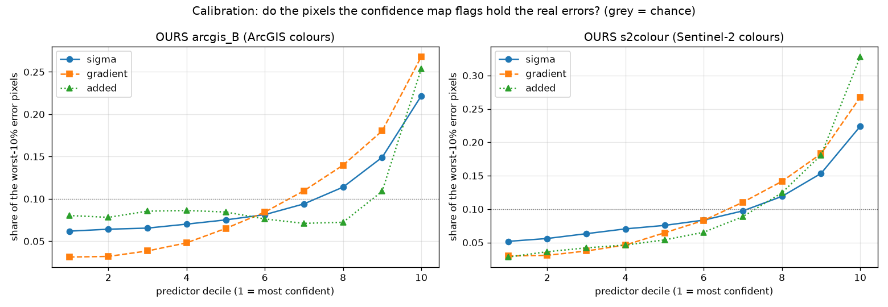

# 7. Uncertainty and error

[← 6. Geospatial consistency](06_geospatial_consistency.md) · next: [8. Limitations](08_limitations.md)

The PS: *"it must clearly manage uncertainty because some reconstructed details are inferred by the model and not
directly observed"* and *"clearly accounting for uncertainty and error components"*. We answer at three levels.

## 7.1 Error components, per model

opensr-test splits every model's high-frequency content into **improvement** (new detail that matches the
reference), **omission** (detail the reference has and the output missed) and **hallucination** (detail far from
both the input and the reference). For our models on the 7 test places
([5.3](05_evaluation.md#53-results-7-unseen-indian-places-in-season)):

| model | improvement ↑ | omission ↓ | hallucination ↓ |
|---|---|---|---|
| arcgis_B | 0.510 | 0.226 | 0.264 |
| s2colour | 0.472 | 0.288 | 0.239 |
| bicubic (adds nothing) | 0.417 | 0.426 | 0.157 |

These are relative weights that sum to 1 per model. Read them against the bicubic row: our models turn about 0.14–0.20
of "omitted" into "improved", and about 0.08–0.11 into "hallucinated". That is the honest price of generative
super-resolution, stated as a number.

## 7.2 A per-pixel confidence map, tested against the real error

A user needs to know **which pixels** are observed and which are inferred. We tested three candidate confidence
layers against the **real error** (colour-matched output vs the reference, 2,800 tiles, 840,000 sampled pixels). The
question: do the pixels a layer flags hold the worst 10% of errors?

| model | layer | AUROC for the worst 10% ↑ | rank corr. with error ↑ | AUROC among pixels of equal edge strength ↑ |
|---|---|---|---|---|
| arcgis_B | date-subset σ (two runs on disjoint halves of the dates) | 0.633 | 0.184 | 0.547 |
| arcgis_B | edge strength of the output | 0.719 | 0.316 | 0.523 |
| arcgis_B | detail added (\|output − bicubic\|) | 0.596 | 0.062 | 0.562 |
| s2colour | date-subset σ | 0.647 | 0.211 | 0.564 |
| s2colour | edge strength of the output | 0.723 | 0.324 | 0.525 |
| s2colour | **detail added (\|output − bicubic\|)** | **0.743** | **0.326** | **0.676** |

(0.5 = chance.) Data: [`results/benchmark/metrics/uncertainty.csv`](../results/benchmark/metrics/uncertainty.csv),
`uncertainty_curve.csv`. Figures:
[`07_uncertainty_maps_s2colour.png`](../results/benchmark/figures/07_uncertainty_maps_s2colour.png),
[`07_uncertainty_maps_arcgis_B.png`](../results/benchmark/figures/07_uncertainty_maps_arcgis_B.png),
[`08_uncertainty_calibration.png`](../results/benchmark/figures/08_uncertainty_calibration.png).

What this shows:
- **For s2colour, "detail added" is a real confidence layer.** Its most-flagged 10% of pixels hold 33% of the worst
  errors; its least-flagged 10% hold 3%. It beats plain edge strength even among pixels of the same edge strength
  (0.676), so it is more than "edges are hard". It costs one bicubic upsample.
- **Date-subset σ is weaker than expected** (0.63–0.65). With 8 dates, each half has 4, so two runs disagree mostly
  where there is any structure at all.
- **For arcgis_B no layer is strong.** Its error is dominated by ArcGIS's per-tile colour and texture, which no
  input-side signal can predict. This is one more reason s2colour is the model for quantitative work.

**What we ship:** the detail-added layer as s2colour's confidence map (bright = inferred, treat with care), σ as a
secondary check (`code/gis_tools.py`: `dual_subsets`, `sigma`), and the provenance note below.

## 7.3 Provenance: what is observed and what is inferred

- **Observed:** each 10 m cell's colour (exactly, for s2colour), the position of structures that the 8 dates
  resolve, and changes between dates.
- **Inferred:** anything smaller than a few metres. The output grid is 2.39 m, but that is **pixel spacing, not
  observed resolution**. A 2 m-wide lane drawn by the model is the model's best estimate from 8 × 10 m samples and
  from what similar places looked like in training.
- The confidence map shows where inference dominates. For decisions at the scale of single buildings (damage
  assessment, encroachment), the output should direct attention, and the finding should be confirmed on
  very-high-resolution imagery.
