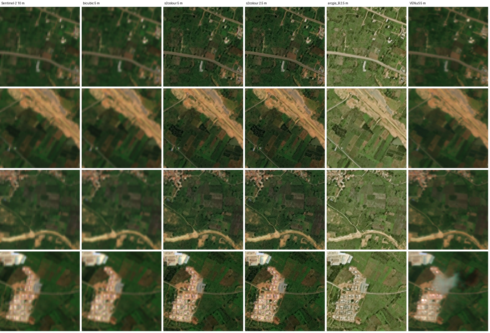

# 9. Why the results are real, why a sharp guess beats a blur, and every metric formula

[← 8. Limitations](08_limitations.md) · [back to README](../README.md)

Our outputs draw street grids, building blocks and field edges from 10 m input. That looks too good to be true, so
this document does three things: lists the evidence that the numbers are real (9.1), explains why we did not use a
transformer such as SwinIR (9.2), proves mathematically why a sharp output with some invented detail is the better
choice than a blurry one (9.3), gives the exact formula of every metric we report (9.4), and states exactly what
s2colour's spectral consistency guarantees and what it does not (9.5), and checks it against an independent
same-day sensor, VENµS (9.6).

## 9.1 "Too good to be true?" The evidence that it is not

**What the output is, and is not.** The model does not *see* 2.39 m detail in a 10 m image. It sees 8 dates of the
same ground, each shifted by a fraction of a pixel, and it has learned from 1.2 million US pairs (Satlas) and 103,936
Indian pairs what Indian streets, roofs and fields look like at 2.39 m. The output is its **best estimate** of the
2.39 m scene, and we say so everywhere ([7.3](07_uncertainty.md#73-provenance-what-is-observed-and-what-is-inferred)).
The claim is not "every pixel is observed"; the claim is "the structure lands where the real structure is", and that
is measured against a reference the model never saw.

| check | what it rules out | evidence |
|---|---|---|
| **Test places the model never saw**, 7 whole places ≥ 54.3 km from any training tile | memorising the test tiles | [2.5](02_data.md#25-no-data-leak); 6 leak checks, all 0: test IDs in training, test IDs in validation, validation IDs in training, byte-identical reference images, test places in the starting model's data |
| **Model selection never touched test data** | tuning on the test set | run A vs B and every checkpoint chosen on 50 validation tiles ([4](04_training.md)) |
| **Rivals run the way their authors run them** | weakened baselines | each loader follows the authors' inference code, with the lines quoted ([5.9](05_evaluation.md#59-how-the-published-models-were-run-fairness), [`code/published_models/`](../code/published_models/)) |
| **An independent benchmark and dataset** | a metric we designed to favour us | ESA's opensr-test, and its own Spanish-city dataset against the Spanish national 2.5 m orthophoto, which we did not collect ([5.7](05_evaluation.md#57-outside-india-esas-opensr-test-benchmark-spanish-cities)) |
| **We do not win everything, and we say so** | cherry-picking | bicubic beats both our models on PSNR and cPSNR; ESA's models invent less (hallucination 0.156–0.166 vs our 0.239–0.264) ([5.3](05_evaluation.md#53-results-7-unseen-indian-places-in-season)) |
| **Invented detail is measured, not hidden** | passing off guesses as observation | opensr-test hallucination per model; a per-pixel confidence map that predicts the real error (AUROC 0.74 for s2colour) ([7](07_uncertainty.md)) |
| **s2colour cannot change what Sentinel-2 measured** | "painting" a different scene | every 10 m cell's mean is locked to the input (mean colour error 0.022); invented detail can only redistribute brightness *inside* a cell ([3.3](03_models.md#33-the-colour-lock-s2colour-only)) |
| **It runs on your machine** | a demo that cannot be reproduced | weights, 16 sample stacks and `infer.py` are in the repository; `ps_proof.py` recomputes every number ([5.11](05_evaluation.md#511-reproducing)) |
| **The gain has an explanation** | an unexplained jump | most of it comes from fine-tuning on Indian pairs: the original Satlas scores edge-F1 0.524, our models 0.638–0.642, and even with a single date 0.600–0.620 ([5.6](05_evaluation.md#56-what-the-8-dates-buy)) |

## 9.2 Why not SwinIR (or another transformer)

We did not skip transformers; we measured them before choosing
([5.10](05_evaluation.md#510-how-the-architecture-was-chosen-phase-2),
[`results/architecture_comparison/`](../results/architecture_comparison/)). On 4 unseen Indian sites (mean of 4):

| model | input | LPIPS ↓ | cPSNR ↑ | SSIM ↑ |
|---|---|---|---|---|
| Satlas multi-date ESRGAN, India fine-tune (our start) | 8 dates | **0.171** | 18.18 | **0.445** |
| Satlas ESRGAN 8-frame, **1-epoch fine-tune** | 8 dates | 0.217 | 17.34 | 0.377 |
| SwinIR-L real-world ×4, **1-epoch fine-tune** (same tiles, same epoch) | median of 8 | 0.280 | 18.01 | 0.387 |
| SwinIR-L real-world ×4, as released | median of 8 | 0.510 | 17.30 | 0.256 |
| Swin2-MoSE, 1-epoch fine-tune | 1 date | 0.484 | **18.59** | 0.394 |

Why the transformers lost here:

1. **At equal training budget, the ESRGAN family still wins.** One epoch on the same 18,794 Indian tiles with the same
   losses (L1 + perceptual + GAN): Satlas ESRGAN 0.211–0.218 LPIPS, SwinIR-L 0.280. So the choice does not rest on our
   longer training of the ESRGAN.
2. **SwinIR is a single-image model.** It cannot take 8 dates; it gets their median, which throws away the sub-pixel
   shifts between dates that multi-image super-resolution relies on (HighRes-net, PROBA-V, WorldStrat:
   [references](../references/README.md#8-multi-image-sr-for-satellites)). The multi-date ESRGAN reads all 24
   channels directly.
3. **The input is tiny for window attention.** SwinIR attends inside 8 × 8 windows. A 32 × 32 px Sentinel-2 tile is
   only 4 × 4 = 16 windows, so the long-range context that makes transformers strong on photographs barely exists.
4. **The pretraining is in the wrong domain.** SwinIR-L was trained on photographs. The Satlas ESRGAN was trained on
   1.2 million Sentinel-2 → aerial pairs, so it starts from satellite texture.
5. **The transformer that led on cPSNR did so by blurring.** Swin2-MoSE had the best cPSNR (18.59, +0.41 dB over the
   India fine-tune) and an LPIPS of 0.484, almost 3× worse. That is exactly the effect proved in 9.3.
6. **Compute.** Training ran on an 8 GB laptop GPU. The ESRGAN (16.7 M parameters) fine-tunes in about 2.7 h per run
   from weights that already know satellite texture; a transformer would have to learn that texture from Indian data
   alone, on the same hardware, after scoring worse at equal budget.

## 9.3 Why a sharp guess beats the blurry average: the proof

### Setup

Let $y$ be the 10 m input (8 dates) and $x$ the true 2.39 m scene. Many scenes $x$ are consistent with the same $y$:
a road edge can sit anywhere inside a 10 m pixel. Everything the input tells us is the posterior $p(x \mid y)$. Write
its mean and total variance as

$$\mu(y) = \mathbb{E}[x \mid y], \qquad V(y) = \mathbb{E}\big[\lVert x - \mu(y) \rVert^2 \mid y\big].$$

### Result 1: the MSE-optimal (PSNR-optimal) output is the average, and the average is blurred

For any output $\hat{x}$ that depends only on $y$:

$$\mathbb{E}\big[\lVert \hat{x} - x \rVert^2 \mid y\big]
= \lVert \hat{x} - \mu \rVert^2 + 2\,\langle \hat{x} - \mu,\ \underbrace{\mathbb{E}[\mu - x \mid y]}_{=\,0} \rangle + V
= \lVert \hat{x} - \mu \rVert^2 + V .$$

This is smallest, and equals $V$ (the MMSE), exactly when $\hat{x} = \mu$. Since
$\text{PSNR} = 10 \log_{10}(255^2/\text{MSE})$ is a decreasing function of MSE, **the PSNR-optimal output is the
posterior mean**: the pixel-wise average of every scene consistent with the input. Averaging edges that sit in
different places gives a soft ramp, not an edge. This is why pixel-loss models (L1/L2, and Swin2-MoSE above) are soft,
and why bicubic scores well on PSNR.

### Result 2: a sharp output drawn from the posterior costs at most 2× the MSE, i.e. at most 3.01 dB of PSNR

Let the output be a *sample* $\hat{x} \sim p(x \mid y)$, drawn independently of the true $x$ given $y$. This is what
an ideal generative model does: a sharp, realistic scene consistent with the input. Then

$$\mathbb{E}\big[\lVert \hat{x} - x \rVert^2 \mid y\big]
= \mathbb{E}\lVert \hat{x} - \mu \rVert^2 + \mathbb{E}\lVert x - \mu \rVert^2
- 2\,\big\langle \underbrace{\mathbb{E}[\hat{x} - \mu \mid y]}_{=\,0},\ \underbrace{\mathbb{E}[x - \mu \mid y]}_{=\,0} \big\rangle
= V + V = 2V .$$

(The cross term splits because $\hat{x}$ and $x$ are independent given $y$.) So the ideal sharp output has exactly
twice the minimum MSE, whatever the scene, and its PSNR is lower by

$$\Delta\text{PSNR} = 10 \log_{10}\frac{2V}{V} = 10 \log_{10} 2 \approx 3.01\ \text{dB}.$$

**The blur can never win by more than 3.01 dB**, and it buys that margin by outputting an image that is not a
possible scene: the mean $\mu$ generally has zero probability under $p(x \mid y)$ (no real road has a four-pixel
ramp for an edge). The sample, by construction, has the same distribution as real scenes. This is the
perception–distortion trade-off that Blau & Michaeli prove holds for any distortion measure
([references](../references/README.md#3-the-perception-distortion-tradeoff)); the 2× bound above is the simple
special case for squared error.

### A worked example: one road edge inside one 10 m pixel

One 10 m pixel covers 4 output pixels in a row. A road edge (0 = field, 1 = road) starts at one of the 4 positions
$J \in \{0,1,2,3\}$, each equally likely given the input; the truth is $x_i = \mathbf{1}[i \ge J]$.

| output | pixels $i = 0..3$ | expected squared error (sum of 4 pixels) | max edge step |
|---|---|---|---|
| **posterior mean** (PSNR-optimal, "blur") | 0.25, 0.50, 0.75, 1.00 | $\sum_i \mu_i(1-\mu_i) = 0.1875 + 0.25 + 0.1875 + 0 = 0.625$ | 0.25 |
| **sharp edge at a random plausible position** (ideal GAN) | a clean 0 → 1 step | $\mathbb{E}\lvert J - J' \rvert = 20/16 = 1.25 = 2 \times 0.625$ | 1.00 |
| **sharp edge at the central position** $J' = 2$ | 0, 0, 1, 1 | $\mathbb{E}\lvert J - 2 \rvert = 1.0 = 1.6 \times 0.625$ | 1.00 |

The blur wins on squared error, but it shows no edge at all: its steepest step is 0.25, so an edge detector at any
reasonable threshold finds nothing, and a mapper cannot digitise a road that is not there. The sharp outputs show
the road, at worst one or two 2.39 m pixels from where it really is, which is still inside the 10 m pixel the input
already constrained. For mapping, digitising and damage triage, the sharp edge is the useful answer.

### What this means in our numbers

Theory says a sharp output may lose up to 3.01 dB against the best blur. On the 7 test places we lose far less, and
gain a lot ([5.3](05_evaluation.md#53-results-7-unseen-indian-places-in-season),
[5.1](05_evaluation.md#51-why-psnr-and-ssim-are-not-the-headline)):

| compared with bicubic (1 date) | arcgis_B | s2colour |
|---|---|---|
| PSNR (colour-normalised), cost | 20.15 vs 20.34: **−0.19 dB** | 19.82 vs 20.34: **−0.52 dB** |
| cPSNR, cost | 20.39 vs 20.78: **−0.39 dB** | 20.41 vs 20.78: **−0.37 dB** |
| edge-F1, gain | 0.408 → **0.642 (+0.234)** | 0.408 → **0.638 (+0.230)** |
| LPIPS, gain | 0.576 → **0.182 (−0.394)** | 0.576 → **0.193 (−0.383)** |
| opensr-test omission (detail missed) | 0.426 → 0.226 (**−0.200**) | 0.426 → 0.288 (**−0.138**) |
| opensr-test improvement (correct new detail) | 0.417 → 0.510 (**+0.093**) | 0.417 → 0.472 (**+0.055**) |
| opensr-test hallucination (invented detail) | 0.157 → 0.264 (**+0.107**) | 0.157 → 0.239 (**+0.082**) |

So the price of sharpness is **at most 0.52 dB of PSNR** (well inside the 3.01 dB bound) and **+0.08–0.11 of
hallucination weight**. In return, missed detail falls by 0.14–0.20, correct new detail rises by 0.06–0.09, edge-F1
rises by 57% (0.41 → 0.64), and the perceptual distance to the reference is cut by two
thirds. The invented part is not hidden: the confidence map marks where it is
([7.2](07_uncertainty.md#72-a-per-pixel-confidence-map-tested-against-the-real-error)), and in s2colour it cannot
change any 10 m cell's measured colour.

## 9.4 The formulas behind every metric

Notation: $\hat{x}$ = super-resolved output (SR), $x$ = reference (HR), $y$ = Sentinel-2 input (LR); images are
8-bit, $H \times W \times C$, with $C = 3$. All tile metrics crop a 4 px border first
([`code/ps_proof.py`](../code/ps_proof.py) `tile_metrics`).

### Metrics that need the reference (only possible on the test places)

**MSE and PSNR** (BasicSR `calculate_psnr`, RGB, not the Y channel):

$$\text{MSE} = \frac{1}{HWC} \sum_{i,j,c} \big(\hat{x}_{ijc} - x_{ijc}\big)^2, \qquad
\text{PSNR} = 10 \log_{10} \frac{255^2}{\text{MSE}} \ \text{dB}.$$

**cPSNR** (PROBA-V challenge metric; [`calculate_cpsnr`](../code/esrgan/metrics.py)): PSNR maximised over shifts
$(u, v) \in \{0..8\}^2$ px of the overlapping crops, after removing the per-channel brightness bias $b_c$:

$$b_c(u,v) = \mathrm{mean}_{ij}\big(\hat{x}_{ijc} - x^{(u,v)}_{ijc}\big), \qquad
\text{cPSNR} = \max_{u,v}\ 10 \log_{10} \frac{255^2}{\mathrm{mean}_{ijc}\big(\hat{x}_{ijc} - x^{(u,v)}_{ijc} - b_c\big)^2}.$$

**SSIM** (Wang et al. 2004; BasicSR `calculate_ssim`: 11 × 11 Gaussian window, σ = 1.5, per channel, averaged):

$$\text{SSIM}(a, b) = \frac{(2\mu_a\mu_b + C_1)(2\sigma_{ab} + C_2)}{(\mu_a^2 + \mu_b^2 + C_1)(\sigma_a^2 + \sigma_b^2 + C_2)},
\qquad C_1 = (0.01 \cdot 255)^2,\ C_2 = (0.03 \cdot 255)^2,$$

with local means $\mu$, variances $\sigma^2$ and covariance $\sigma_{ab}$ from the Gaussian window, averaged over all
windows and channels.

**Colour normalisation** (the `cn_*` columns; `colour_match` in [`ps_proof.py`](../code/ps_proof.py)): before PSNR,
SSIM and LPIPS, each output channel gets the reference's mean and spread, so the ArcGIS-vs-Sentinel-2 colour
convention does not decide the score:

$$\tilde{x}_{ijc} = \frac{\hat{x}_{ijc} - \mu_c(\hat{x})}{\sigma_c(\hat{x})}\,\sigma_c(x) + \mu_c(x).$$

**LPIPS** (Zhang et al. 2018; AlexNet backbone, `lpips` package). Deep features $f^l$ from layers $l$, unit-normalised
along channels, weighted per channel by learned $w_l$ (fitted to human judgements), averaged over positions:

$$\text{LPIPS}(\hat{x}, x) = \sum_l \frac{1}{H_l W_l} \sum_{h,w}
\Big\lVert w_l \odot \big(\hat{f}^{\,l}_{hw} - f^{\,l}_{hw}\big) \Big\rVert_2^2 .$$

Lower is better; 0 means identical features.

**Edge-F1** ([`calculate_edge_f1`](../code/esrgan/metrics.py)). Both images go to grayscale, are stretched so their
2nd–98th percentiles span 0–255 (colour and contrast removed), blurred with a Gaussian of σ = 2 px (so texture is not
counted as structure), and passed through Canny (thresholds 50, 150), giving edge maps $E_{\hat{x}}$ and $E_x$. With
$D(\cdot)$ a dilation by a 3 × 3 square (1 px tolerance):

$$P = \frac{\lvert E_{\hat{x}} \cap D(E_x) \rvert}{\lvert E_{\hat{x}} \rvert}, \qquad
R = \frac{\lvert E_x \cap D(E_{\hat{x}}) \rvert}{\lvert E_x \rvert}, \qquad
\text{edge-F1} = \frac{2PR}{P + R}.$$

Precision $P$ = share of output edges that are real; recall $R$ = share of real edges that the output drew.

**Gradient correlation** ([`calculate_grad_corr`](../code/esrgan/metrics.py)): Pearson correlation of Sobel gradient
magnitudes $g = \sqrt{(\partial_x I)^2 + (\partial_y I)^2}$ of the same stretched grayscale images:

$$r = \frac{\sum_k (g_{\hat{x},k} - \bar{g}_{\hat{x}})(g_{x,k} - \bar{g}_x)}
{\sqrt{\sum_k (g_{\hat{x},k} - \bar{g}_{\hat{x}})^2}\ \sqrt{\sum_k (g_{x,k} - \bar{g}_x)^2}} \in [-1, 1].$$

**opensr-test correctness: improvement, omission, hallucination** (ESA, package v1.3.3; run on 4 × 4-tile chips, 128 px
in, 512 px out, after opensr-test histogram-matches the output to the reference). For the high-frequency detail of
the output, opensr-test measures at each pixel two distances: to the reference ($d_{\text{HR}}$, "is this detail
real?") and to the upsampled input ($d_{\text{LR}}$, "is this just the input?"). Each pixel is assigned to the
nearest of three regions: **improvement** (close to HR), **omission** (close to LR, i.e. nothing added) or
**hallucination** (far from both). The three scores are the shares of the output's detail in each region, so

$$\text{im} + \text{om} + \text{ha} = 1 .$$

Because they are shares, even bicubic (which adds nothing) gets non-zero improvement, which is why every model must be
read against the bicubic row. In the authors' words: "the primary objective is to classify and quantify how much of the
high-frequency representation is an improvement (SR close to HR), omissions (SR close to LR), or hallucinations (SR
far from both LR and HR)" ([references](../references/README.md#7-opensr-test)).

### Metrics that need only the input (possible on every generated tile)

These compare the output with its own Sentinel-2 input $y$, which always exists. $\downarrow$ is opensr-test's
downsampling of the output back to the input's 10 m grid.

**Reflectance consistency** (opensr-test default: L1; the "colour vs input" column):

$$\text{reflectance} = \frac{1}{N} \sum_k \big\lvert (\hat{x}\!\downarrow)_k - y_k \big\rvert .$$

**Spectral consistency** (spectral angle, degrees). For the colour vectors $a = (\hat{x}\!\downarrow)_k$ and $b = y_k$
at each 10 m pixel:

$$\theta_k = \arccos \frac{\langle a, b \rangle}{\lVert a \rVert\,\lVert b \rVert}, \qquad
\text{spectral} = \frac{1}{N} \sum_k \theta_k .$$

**Spatial consistency** (opensr-test v1.3.3 default: phase correlation). The shift $(\Delta u, \Delta v)$ that
maximises the normalised cross-power spectrum between $\hat{x}\!\downarrow$ and $y$, in input pixels:

$$R = \mathcal{F}^{-1}\!\left[\frac{\mathcal{F}(\hat{x}\!\downarrow)\,\overline{\mathcal{F}(y)}}
{\lvert \mathcal{F}(\hat{x}\!\downarrow)\,\overline{\mathcal{F}(y)} \rvert}\right], \qquad
(\Delta u, \Delta v) = \arg\max R ,$$

and the spatial score is the size of that sub-pixel shift.

Added detail can move this peak even when nothing moved, which is why [6.4](06_geospatial_consistency.md#64-why-opensr-tests-spatial-score-reports-drift-that-is-not-there)
also measures position with the fine detail removed.

**Colour lock** (s2colour, by construction; [3.3](03_models.md#33-the-colour-lock-s2colour-only)). With $A$ the
4 × 4 block average and $m$ the per-pixel median of the 8 input dates, the network repeats three times

$$\hat{x} \leftarrow \hat{x} + \text{bicubic}_{\uparrow 4}\big(m - A\hat{x}\big),$$

which drives $A\hat{x} \to m$: every 10 m cell of the output keeps the colour Sentinel-2 measured
(block error 12.7 → 0.25 of 255 on validation tiles; about 3 of 255 on the VENµS patches of
[9.6](#96-independent-check-against-venµs-same-day-5-m-reflectance) and about 7 of 255 on the 2,800 test tiles,
[5.12](05_evaluation.md#512-why-model-3-is-its-own-model-colouring-model-1-afterwards-does-not-work)).

**Confidence map** ("detail added"; [7.2](07_uncertainty.md#72-a-per-pixel-confidence-map-tested-against-the-real-error)):

$$c_{ij} = \big\lvert \hat{x}_{ij} - \text{bicubic}_{\uparrow 4}(y)_{ij} \big\rvert ,$$

bright where the model added detail the input does not directly show.

### How the confidence map itself was validated (on the test places)

**AUROC** (`auroc` in [`ps_proof.py`](../code/ps_proof.py), the Mann–Whitney form). Label a pixel positive if its real
error against the reference is in the worst 10%. With $r_k$ the rank of pixel $k$'s confidence score among all $n$
pixels, $n_1$ positives and $n_0$ negatives:

$$\text{AUROC} = \frac{\sum_{k \in \text{pos}} r_k - \frac{n_1(n_1 + 1)}{2}}{n_1\, n_0} .$$

It is the probability that a randomly chosen bad pixel gets a higher confidence score than a randomly chosen good
one; 0.5 is chance, 1 is perfect. For s2colour's map it is 0.743 over 840,000 pixels.

### Why the first group cannot be computed on a new tile

Every formula in the first group has $x$, the reference, in it. On a newly generated tile there is no $x$: if a 2.39 m
image of that place and date existed, nobody would need super-resolution. So those metrics are measured once, on held-out
places that do have a reference, and describe how the model behaves on unseen land. The second group uses only $y$
and $\hat{x}$, so it can be computed for every output; the app shows the confidence map as a layer ("Confidence heatmap").

## 9.5 Spectral consistency: what s2colour guarantees, and what it does not

s2colour's output bands are tied to Sentinel-2's own measurements. The lock
([3.3](03_models.md#33-the-colour-lock-s2colour-only)) forces the mean of every 4 × 4 block of output pixels (one
10 m cell) onto the value Sentinel-2 measured for that cell, **separately in each band: B04 (red, 665 nm), B03
(green, 560 nm) and B02 (blue, 490 nm)**. At the 10 m scale, the value of each band therefore comes from the
measurement, not from the network.

### The guarantee, stated precisely

For each band $b \in \{\text{B04}, \text{B03}, \text{B02}\}$, with $A$ the 4 × 4 block mean and $m_b$ the per-pixel
median of that band over the 8 input dates, the lock drives

$$A\hat{x}_b = m_b \qquad \text{(approximately, after three correction steps)}$$

The residual is 0.25 of 255 on validation tiles, about 3 of 255 on the SEN2VENµS patches of
[9.6](#96-independent-check-against-venµs-same-day-5-m-reflectance) and about 7 of 255 (0.0104 reflectance) on the
2,800 test tiles ([5.12](05_evaluation.md#512-why-model-3-is-its-own-model-colouring-model-1-afterwards-does-not-work));
more steps would shrink it, but at the cost of visibly softer detail, so the released model keeps three.

Anything computed from 10 m block means therefore gives the same answer on the output as on the input:

- **Reflectance consistency, per band:** $\frac{1}{N}\sum_k \lvert (A\hat{x}_b)_k - (m_b)_k \rvert \approx 0$.
- **Spectral angle:** each block's band vector $(B04, B03, B02)$ equals the input's, so
  $\theta_k = \arccos\frac{\langle A\hat{x}_k, m_k\rangle}{\lVert A\hat{x}_k\rVert\,\lVert m_k\rVert} \approx 0$, i.e.
  the spectral signature of every 10 m cell is kept.
- **Any linear quantity** (band means, zonal statistics over whole 10 m cells, band differences such as B04 − B03)
  matches the input in the same way, because averaging is linear: summing a band over a cell of the output is summing
  that band of the input.

The network is free only *inside* a cell: in each band, it decides how the cell's fixed value is distributed among its
16 output pixels. A higher B04 value in one corner forces the rest of the cell lower in B04, so invented detail cannot
change what any 10 m cell measured in any band.

Measured:

| where | s2colour | arcgis_B | SEN2SR Lite (ESA) |
|---|---|---|---|
| India, reflectance vs input (opensr-test, L1 over B04/B03/B02) ↓ | **0.022** | 0.095 | 0.005 |
| Spain, reflectance (L1) ↓ | **0.0066** | 0.0317 | 0.0289 |
| Spain, spectral angle over B04/B03/B02 (°) ↓ | 0.723 | 4.306 | **0.671** |

([5.3](05_evaluation.md#53-results-7-unseen-indian-places-in-season),
[5.7](05_evaluation.md#57-outside-india-esas-opensr-test-benchmark-spanish-cities).) arcgis_B is far off by design:
it reproduces the ArcGIS basemap's rendering, not Sentinel-2's band values.

### Why this is "consistent", not "never wrong"

The lock makes s2colour **agree with Sentinel-2's B04, B03 and B02 at 10 m**. That is the problem statement's
spectral consistency, and it holds by construction. It does not make every band value correct:

1. **Band values of individual 2.39 m pixels are inferred.** Only each cell's mean per band is fixed. Which of its 16
   pixels carry the low B04/B03/B02 values of a road and which the high values of a roof is the model's estimate, and
   it can be wrong. The confidence map shows where this is likely
   ([7.2](07_uncertainty.md#72-a-per-pixel-confidence-map-tested-against-the-real-error)).
2. **The lock follows the median of 8 dates, not one date.** If the ground changed between dates (a crop harvested,
   a flood receding), each band shows the median state, not the state on any single day.
3. **Sentinel-2 is the reference, errors included.** The input is L2A surface reflectance; any error in its
   atmospheric correction, or residual haze in some dates, is locked in too. Consistent with Sentinel-2 means exactly
   that, not consistent with the ground.
4. **High reflectance is clipped.** Each band is stored as ESA's true-colour product does: reflectance / 0.3558 →
   1–255 ([`sentinel2_collector.py`](../code/collectors/sentinel2_collector.py)). Snow, white roofs and bright sand
   with reflectance above 0.3558 in a band saturate at 255, so the lock is to the clipped value, not the true
   reflectance.
5. **The benchmark numbers are small, not zero.** The lock is iterative (0.25–7 of 255 left after three steps, depending on the scene), the
   output is clipped to 0–255, and opensr-test downsamples with its own filter rather than the exact 4 × 4 block
   mean. That is why reflectance is 0.022 in India, not 0. On spectral angle in Spain, ESA's SEN2SR (0.671°) is
   slightly closer than s2colour (0.723°), because it adds less detail.
6. **Three bands only.** The lock covers B04, B03 and B02, the only bands the reference has to train against. B08
   (NIR), the red-edge bands and B11/B12 (SWIR) are not super-resolved, so NDVI (B08, B04), NDWI (B03, B08) and NBR
   (B08, B12) must still be computed from the native 10–20 m bands ([8](08_limitations.md)).

**In one line:** s2colour can never contradict what Sentinel-2 measured in B04, B03 or B02 for a 10 m cell (within
the stated tolerances), but the band values of each 2.39 m pixel inside that cell are still the model's best
estimate. For quantitative work, aggregate to whole 10 m cells or larger, where the band values are the measurement.

## 9.6 Independent check against VENµS (same-day 5 m reflectance)

**Why this check.** Our training and test reference is ArcGIS World Imagery, an 8-bit rendered basemap captured on a
different day. SEN2VENµS (Michel et al. 2022) is the opposite kind of reference: VENµS **surface reflectance** of
the same place **on the same day** as the Sentinel-2 image, at 5 m. It is too coarse to train a < 4 m model on
([1.4](01_approach_and_decisions.md#14-why-we-chose-what-we-chose)), but it is an independent test of band values,
with no ArcGIS involved.

**Data.** Site KUDALIAR, Telangana (78.58–78.87° E, 17.99–18.19° N): **215 km from the nearest training place**
(Latur) and 75 km from the nearest test place (Hyderabad). Only the patches needed were fetched (175 MB of the 7.9 GB
site archive, [`sen2venus_check.py`](../results/sen2venus/sen2venus_check.py)): two dates of tile 44QKF,
2019-08-27 (monsoon, 185 patches) and 2020-10-30 (131 patches). Every October patch has some no-data pixels, so the
scored set is the **185 August patches** (1.28 km × 1.28 km each). Script, per-patch values and figure:
[`results/sen2venus/`](../results/sen2venus/).

**Method.** Each Sentinel-2 patch (B04, B03, B02, scaled like ESA true colour) goes to the models as a single date
repeated into the 8 input slots (the 1-date setting of [5.6](05_evaluation.md#56-what-the-8-dates-buy)). The 2.5 m
output is averaged 2 × 2 onto VENµS's 5 m grid and compared with VENµS; bicubic from the same 10 m input is the
baseline. The two sensors' own disagreement is measured too: VENµS averaged to 10 m against the Sentinel-2 input.

### Results (185 patches, 5 m, [`results.csv`](../results/sen2venus/results.csv))

| | bicubic | **s2colour** | arcgis_B |
|---|---|---|---|
| reflectance error vs VENµS, mean of B04/B03/B02 (L1) ↓ | 0.0043 | **0.0081** | 0.0581 |
| &nbsp;&nbsp;B04 / B03 / B02 | 0.0051 / 0.0042 / 0.0035 | 0.0086 / 0.0082 / 0.0076 | 0.0676 / 0.0653 / 0.0413 |
| spectral angle vs VENµS (°) ↓ | 1.64 | **2.48** | 5.60 |
| PSNR ↑ / SSIM ↑ | 35.46 / 0.955 | 29.98 / 0.768 | 15.13 / 0.520 |
| edge-F1 ↑ | 0.867 | 0.834 | 0.707 |
| LPIPS ↓ | 0.053 | 0.218 | 0.344 |
| *for scale:* Sentinel-2 vs VENµS at 10 m, the sensors' own disagreement | reflectance 0.0040, spectral angle 1.53° | | |

*The four patches with the most structure in VENµS, central 640 m. Columns: Sentinel-2 10 m | bicubic 5 m |
s2colour 5 m | s2colour 2.5 m | arcgis_B 2.5 m | VENµS 5 m.*

### What it shows

1. **s2colour's band values agree with an independent same-day sensor.** Its B04/B03/B02 error against VENµS is
   0.0081 reflectance, against 0.0040 for the two sensors' own disagreement: about **0.004 above the sensor floor,
   and 7× closer than arcgis_B** (0.058), whose ArcGIS rendering is not reflectance. The spectral angle tells the
   same story (2.48° against a 1.53° floor; arcgis_B 5.60°).
2. **Bicubic scores best on every metric here, and it should.** This VENµS reference holds almost nothing beyond
   10 m: averaging it to 10 m and upsampling it back reproduces it at PSNR 44.0 dB, SSIM 0.986 and edge-F1 0.946
   ([`results.csv`](../results/sen2venus/results.csv), `venus_detail`). A reference that soft is matched best by the smooth
   interpolation of the 10 m input, and any added detail counts as error, correct or not. It is 9.3 again, with the
   reference itself on the blurred side. So **this check measures band values, not super-resolution**; the figure
   shows that the structures s2colour draws (roads, field edges, the housing blocks in row 4) are where VENµS and
   Sentinel-2 place them, but VENµS is too soft to score them.
3. **Part of s2colour's extra error is its lock residual, and removing it costs sharpness.** On these patches the
   lock leaves 0.0045 reflectance (about 3.1 of 255) between each 10 m block mean and the input, more than the 0.25 of
   255 measured on validation tiles ([3.3](03_models.md#33-the-colour-lock-s2colour-only)): s2colour's raw output
   is far off before the lock, and three correction steps do not fully converge. More steps close the gap (60 of these
   patches: 3 steps 3.14, 6 steps 0.16, 10 steps 0.01 of 255), but they also **soften the image**: from 3 to 10 steps
   pixels change by 3.7 of 255 on average (up to 84), the fine detail of the two versions correlates 0.97, and their
   edges agree only at edge-F1 0.67. Each correction is spread with bicubic interpolation, and repeating it
   progressively cancels detail at the 10 m cell scale
   ([`lock_steps_3_vs_10.png`](../results/sen2venus/lock_steps_3_vs_10.png): 3 steps | 10 steps | difference × 10).
   It is the same trade-off as 9.3, inside the lock: exact 10 m band values against sharp 2.39 m structure. The
   released model keeps 3 steps, and the residual is reported instead.
4. **The confidence map ranks VENµS error well** (AUROC 0.907, [`results.csv`](../results/sen2venus/results.csv)),
   but this is close to built in: VENµS has almost no detail beyond 10 m, so the error against it is mostly the
   detail the model added, which is what the map measures. The ArcGIS test in
   [7.2](07_uncertainty.md#72-a-per-pixel-confidence-map-tested-against-the-real-error) (0.743) is the meaningful one.

**Limits of this check:** one Indian site, one date, 185 patches, single-date input (the models' weaker mode), a
10 m input grid instead of the 9.55 m the models were trained on, and Theia (MAJA) L2A processing instead of the
Copernicus L2A the models were trained on. VENµS data: CNES/Theia, CC BY-NC 4.0; Sentinel-2 patches: Etalab 2.0.
